# TO-DOs

1. Create a new database called shirst_db

    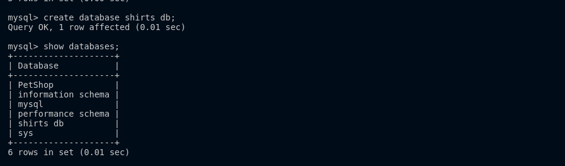

2. Create a new table called shirts, the champs are shirt_id(primary key), article(type of shirt), color, shirt_size and last_worn(integers, number of days).

    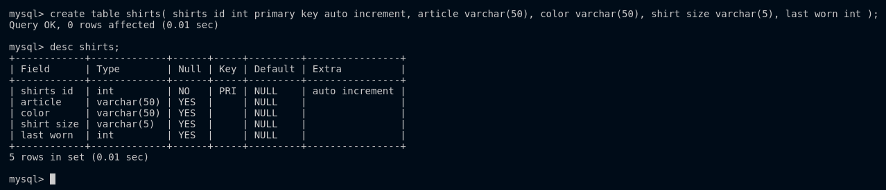

3. Insert data

    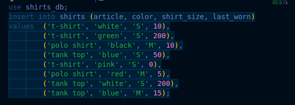

4. Add a new t-shirt that is purple, polo shirt, size M, last worn 50 days ago.

    

5. Select all of the shirts but only printing their article and their color.

    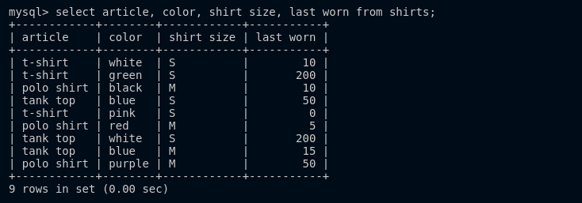

6. Select all medium shirts, prnt everything but shhirt_id

    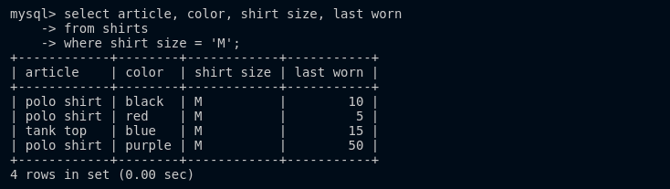

7. Update all polo shirts, change their size to L

    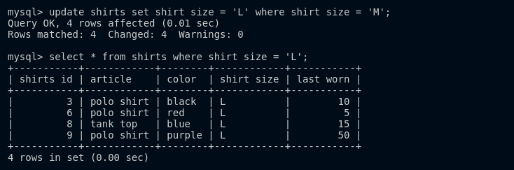

8. Update the shirt that was last worn 15 days ago, change last-worn to 0.

    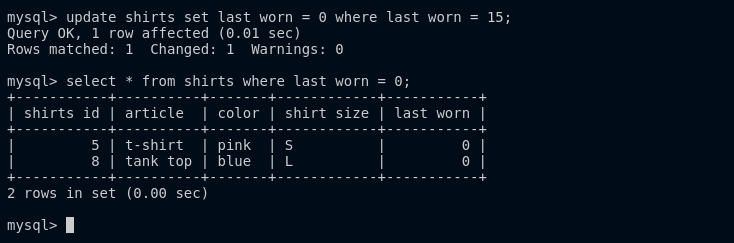

9. Update all the white shirts and change them to 'off white', and the size to be 'XS'.

    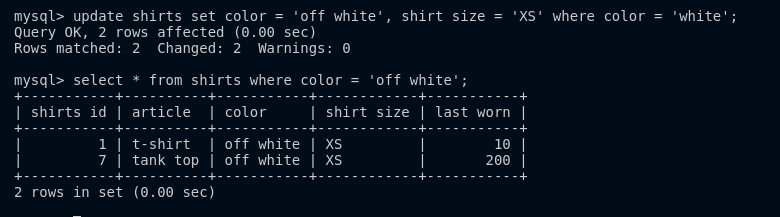

10. delete all old shirts (last worn 200 days ago).

    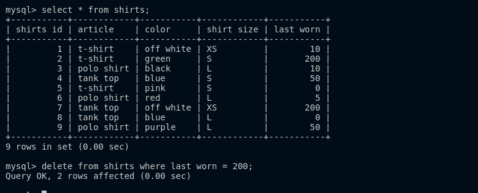

11. delete all the tanktops.

    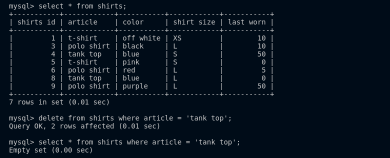

12. Delete all shirts.

    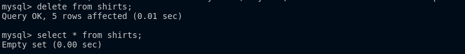

13. Drop the entire shirst table.

    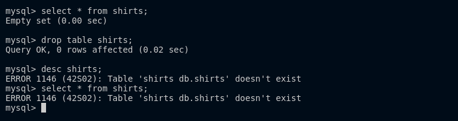