# Intro to CRUD
* CRUD is an acromym that stands for  Create Read Update and Delete.
* Create is when we create table and insert data.
* For Reading, we use the SELECT keyword, to select rows in the table and viewing their content.
    * select name from cats --> is going to give me only the names of the cats.
    
     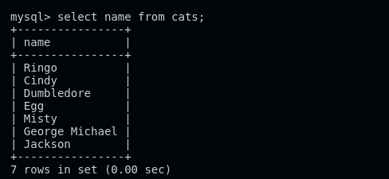

    * select age from cats; --> displays the ages of the cats in the table.
    
    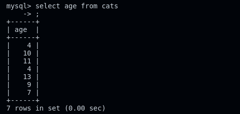
* to combine multiple columns we just neee dto separate their names woth commas.
    * Select name, age from cats --> gives us the names of the cats and their ages.
    
    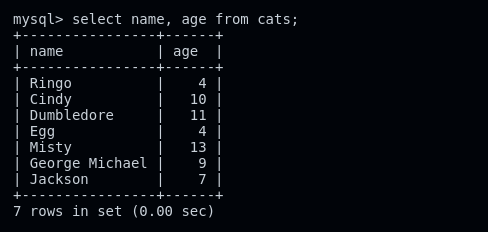
* The where clause allows us to narrow down the rows we're working with. for exemple, `select * from cats where age = 4;`

 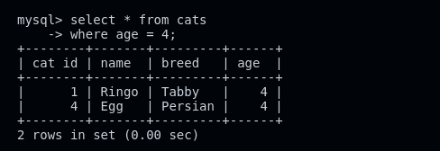

* select name, age from cats where age = 4:

    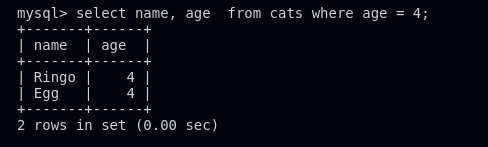

* select * from cats where name = 'egg';

    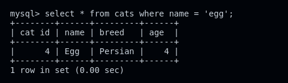

* it is not limited to select.

* For UPDATE, we use the update keyword to change data in the table. the syntax is `update table SET breed = 'junior'.

    ```sql
        update cats set age = 14 where name = 'Misty';
    ```
CAUTION: select before updtating.

* for Delete we use delete from  ats where name = 'something'; 

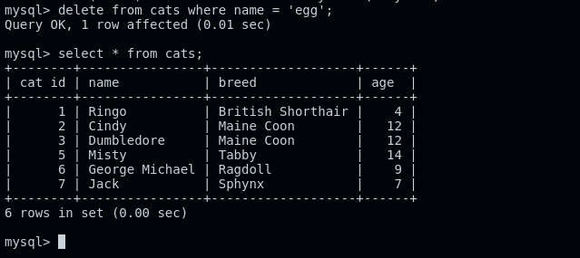

* delete from table is giung to erase all the information in the table.

    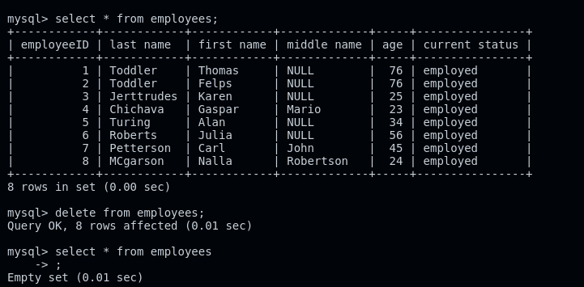

### exercise 1.

* cat_id for all the rows

    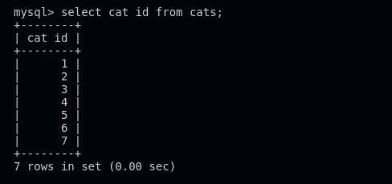

* name and breed.

    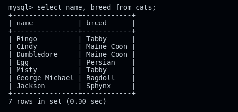

* tabby cats

    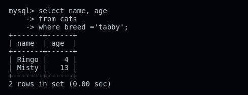

* cat_id same as their age

    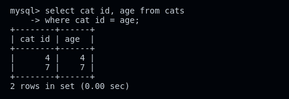

## Aliases

 it is useful to rename a column to make it shorter and easier to understand.
    
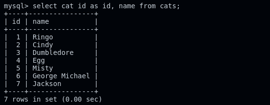

to use aliases, we have to use the keyword as, folowed by the temporary name for the column we want to work with.

### Exercise 2 - updates

* change Jackson's name to Jack

    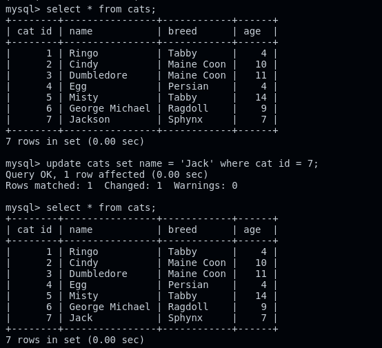

* change ringo's breed to British Shorthair

    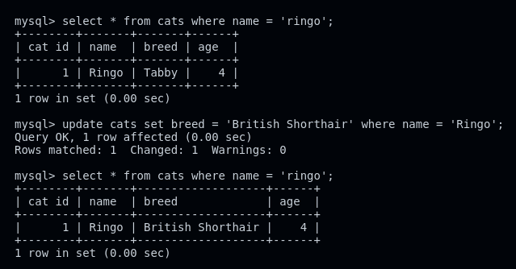

* update both maine coons ages to be 12

    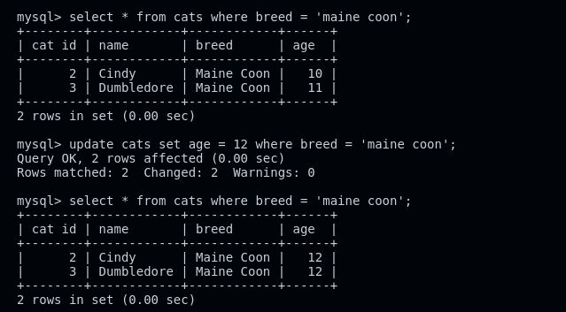


### Exrcise 4
* delete all 4 year old cat

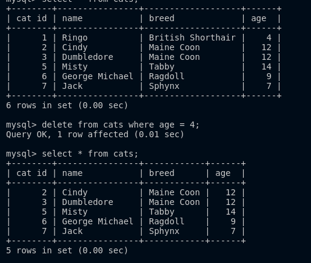

* delete all cats with their ids equal to their age.

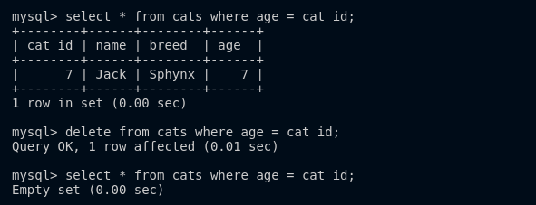

* Delete all the cats

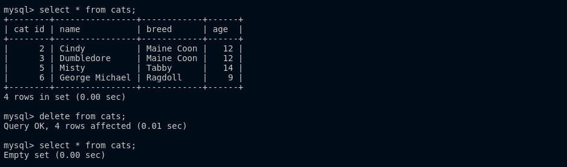


